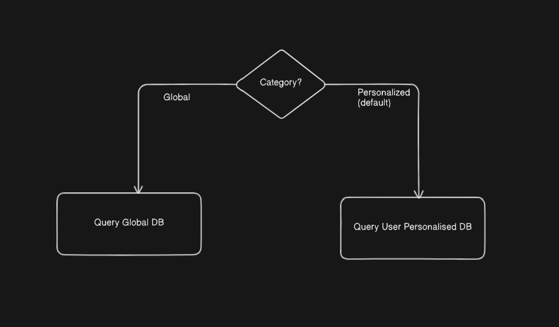
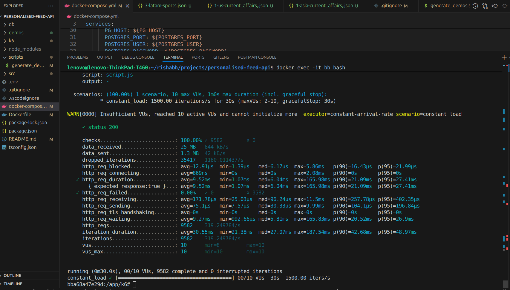
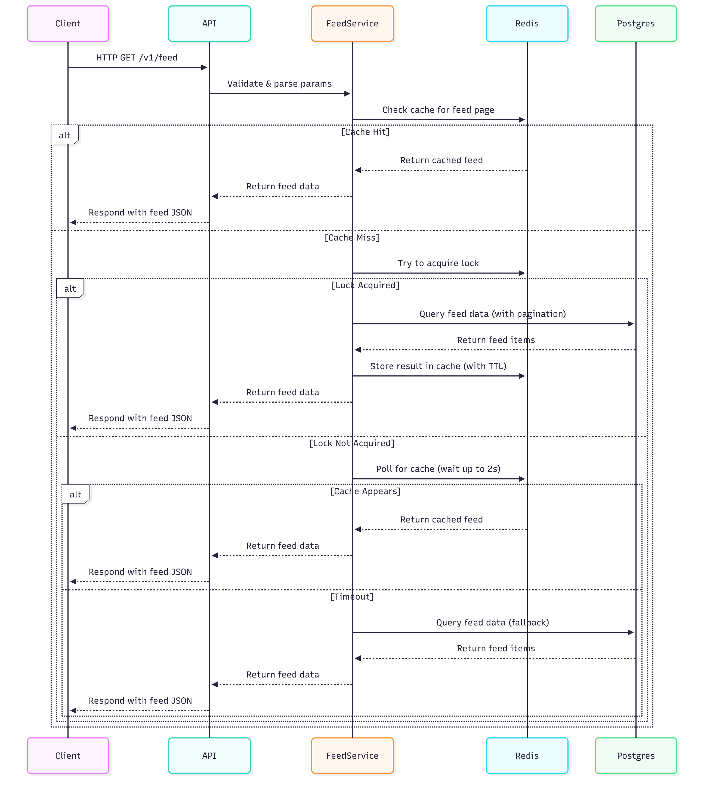

# Personalised Feed API

## Prerequisites

- Docker & Docker Compose (for Postgres and Redis)
- npm (for local commands)
- Node.js 20 (used in app container; no need to install locally unless you want to run outside Docker)

## .env Example

```
PGHOST=postgres
PGPORT=5432
PGUSER=postgres
PGPASSWORD=postgres
PGDATABASE=feeddb
REDIS_URL=redis://redis:6379
PORT=3000
```

## Setup Steps (All commands run inside the app container)

1. **Start all services (app, DB, Redis) in Docker:**

   ```bash
   docker-compose up --build
   ```

2. **Open a shell in the app container:**

   ```bash
   docker-compose exec -it <app-container-id> bash
   ```

3. **Install dependencies (if not already):**

   ```bash
   npm install
   ```

4. **Seed the database:**

   ```bash
   npm run seed
   ```

   - Seeds 5,000 posts across regions/categories
   - Seeds 5 users with region and preference weights
   - Materializes `user_feed_view` with personalized scores

   **Score Calculation Logic (in `src/seeder.ts`):**

   - For each user and post:
     - `personalized_score = 0.5 * recencyScore + 0.35 * popularityNorm + 0.15 * userPrefWeight`
     - **Recency Score:**
     - `recencyScore = exp(-ageDays / 7)` (newer posts get higher score)
     - **Popularity Normalized:**
     - `popularityNorm = post.popularity / maxPopularity` (scales 0-1)
     - **User Preference Weight:**
     - From user profile, e.g. `{ sports: 0.6, technology: 0.2, ... }`
     - **Materialization:**
     - For each user, all posts are scored and inserted into `user_feed_view`.

5. **Start the API server:**

   ```bash
   npm run start
   ```

6. **Generate demo JSONs:**
   ```bash
   npm run demo
   ```
### Demos can be found in the directory `demos/`

## API Usage

### Endpoint

`GET /v1/feed?userid=...&region=...&segment=...&limit=...&cursor=...`

### Response

```json
{
  "data": [ ... ],
  "pagination": {
	 "nextCursor": "...",
	 "limit": ...
  },
  "meta": { "responseTime": ... }
}
```

### Cursor Pagination

- Cursor is a string: `{score}|{id}` for personalized, `{ts}|{id}` for global
- Pagination is stable and ordered by `(personalized_score, ts, id)` descending
- To fetch next page, pass `nextCursor` from previous response

### Caching Logic

- **Cache key:** `feed:{userId}:{limit}:{region}:{category}_{segment}:{cursor}`
- **TTL:** 300s ±20% jitter (see `jitteredTTL` in `src/cache.ts`)
- **Stampede protection:**
  - Redis lock (`SET NX PX 10000`)
  - If lock not acquired, poll for cache up to 2s, then fallback to DB
- **Cache covers:** All feed queries (user, region, segment, cursor, limit)

## Category Based Decision



```bash
# For Personalized feed pass category=personalized (this is also default mode which gives user with userid's personal feeds)
curl "http://localhost:3000/v1/feed?userid=2&region=eu&segment=sports&limit=10"
curl "http://localhost:3000/v1/feed?userid=3&region=in&segment=hot&limit=10"
curl "http://localhost:3000/v1/feed?userid=1&region=us&segment=current_affairs&limit=10&cursor={cursor}"

# For Global feed pass category=global
curl "http://localhost:3000/v1/feed?userid=2&category=global&region=eu&segment=sports&limit=10"
curl "http://localhost:3000/v1/feed?userid=3&category=global&region=in&segment=hot&limit=10"
curl "http://localhost:3000/v1/feed?userid=1&category=global&region=us&segment=current_affairs&limit=10&cursor={cursor}"
```

## Load Testing

1. Using k6 for load testing: https://grafana.com/docs/k6/latest/, k6 is already installed in app container via `Dockerfile`
2. Exec in the app container `docker exec -it <container-id> sh`
3. Run:
   ```bash
   k6 run k6/script.js
   ```
   - Targets 1500 RPS
   - Asserts p95 < 50ms, p99 < 120ms, error rate < 0.5%
  
### Results


## How It Works

- **Seeder:** Seeds posts/users, calculates scores, materializes personalized view
- **Scoring:** Blends recency, popularity, and user preference
- **Caching:** Redis with stampede protection and jittered TTL
- **Pagination:** Cursor-based, stable, efficient

## Notes

- All commands (seeding, k6, etc.) should be run inside the app container for consistency
- Node.js 20 is used in the container; no need to install locally unless running outside Docker


# API Flow



Feed API Flow (with Redis Caching & Stampede Protection)

1. **Client Request**:
The client sends a GET /v1/feed request with pagination and filter parameters.

2. **Parameter Validation**:
The API layer validates and parses query parameters before calling the FeedService.

3. **Cache Lookup**:
The FeedService first checks Redis for a cached version of the requested feed page.

4. **Cache Hit**:
If cache exists → return the cached feed response immediately.
Response time is minimal (no DB call needed).

5. **Cache Miss**:
If cache doesn’t exist → FeedService tries to acquire a Redis lock for that feed key.
This prevents multiple requests from hitting the DB simultaneously (avoiding a “thundering herd”).

6. **Lock Acquired (Leader Request)**:
The leader request queries Postgres for feed items.
Once data is fetched, it is stored in Redis with a TTL (time-to-live) for caching.
The response is sent back to the client.

7. **Lock Not Acquired (Follower Requests)**:
Other concurrent requests (followers) poll Redis for up to 2 seconds waiting for the cache to appear.
If the cache becomes available → they return cached feed data.

8. **Timeout Fallback**:
If cache doesn’t appear within the wait window, the follower request queries Postgres directly as a fallback.
Feed data is returned to the client (but not cached again to avoid duplication).

9. **Subsequent Requests**:
All later requests within the cache TTL window are served directly from Redis.